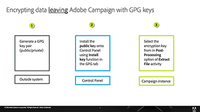

# 控制面板 - 概觀

「控制面板」可讓Adobe Campaign管理員監控關鍵資產並執行管理工作，例如依執行個體管理SFTP儲存、允許列出IP位址或管理GPG金鑰。

## 員工精選

<table>
<tr>
<td>
    
    

      <a href="./get-started.md">
    <strong>控制面板快速入門</strong>
    </a>
    

    

    <em>了解如何存取控制面板，以及使用控制面板的先決條件。  </em>
    

  </td>
  <td>
    
    

      <a href="./instance-settings/gpg-key-management/generate-and-install-gpg-keys.md">
    <strong>產生並安裝資料加密所需的GPG金鑰</strong>
    </a>
    

    

    <em>了解如何使用用戶端 SFTP 應用程式，使用您儲存在控制面板的金鑰，連線至您的 SFTP 伺服器。</em>
    

  </td>
  <td>
    
    

      <a href="./sftp-management/connect-to-sftp-server.md">
    <strong>連結到 SFTP 伺服器</strong>
     </a>
    

    

    <em>了解如何使用用戶端 SFTP 應用程式，使用您儲存在控制面板的金鑰，連線至您的 SFTP 伺服器。</em>
    

  </td>
</tr>
</table>

## 其他資源

* [控制面板說明中心](https://experienceleague.adobe.com/docs/control-panel/using/control-panel-home.html?lang=zh-Hant)
