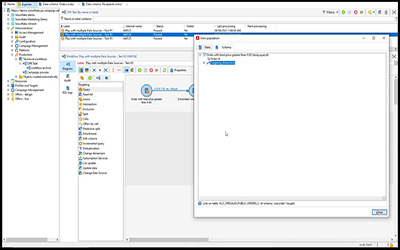
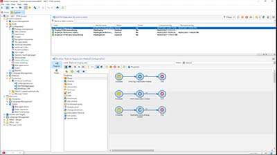

# Adobe Campaign V8 教學課程 – 概覽

Adobe Campaign 為跨頻道客戶體驗設計提供平台，並為視覺行銷活動的策劃、即時互動管理和跨頻道執行提供環境。本使用手冊包含了 Adobe Campaign V8 許多功能的相關影片和教學課程。

>[!INFO]
> 有疑問嗎？ 您想與同行分享經驗或交流想法嗎？ 或者，您是否對 Adobe 團隊的學習內容有回饋？ 在 [Adobe Campaign 學習社群對話串](https://experienceleaguecommunities.adobe.com:443/t5/adobe-campaign-classic/join-the-discussion-on-adobe-campaign-learning/td-p/419096?lang=zh-Hant)中加入對話！

>[!NOTE]
> Campaign V8 目前僅以 Managed Cloud Service 的形式提供，且無法部署在內部部署或混合環境中。 尚無法從現有 Campaign Classic V7 環境進行移轉。
>請參閱 [Classic V7 至 V8 產品文件](https://experienceleague.adobe.com/docs/campaign/campaign-v8/start/capability-matrix.html?lang=zh-Hant) ，深入瞭解這兩個版本之間的差異。 另請參閱 [Campaign Classic V7 教學課程](https://experienceleague.adobe.com/docs/campaign-classic-learn/tutorials/overview.html?lang=zh-Hant)一節，觀看教學影片。

## 新增功能

* **[SMPP 協定深入剖析和疑難排解](https://experienceleague.adobe.com/docs/campaign-learn/set-up-sms-for-adobe-campaign/smpp-deep-dive-and-troubleshooting.html?lang=zh-Hant)**

   *瞭解如何建立 SMPP 連線以及 SMPP 如何通過 PDU 交換資料。 瞭解如何疑難排解連線問題。* 

* **[控制面板 — 監視工作流程](https://experienceleague.adobe.com/docs/control-panel-learn/control-panel/performance-monitoring/monitor-workflows.html?lang=zh-Hant){target=&quot;_blank&quot;}**

   *瞭解如何監視工作流程的臨時儲存使用情況以及在何處編輯工作流程設定以避免執行個體出現資料庫或工作流程問題。*

* **[控制面板 — 監視輸送量和延時](https://experienceleague.adobe.com/docs/control-panel-learn/control-panel/performance-monitoring/monitor-throughputs-and-latency.html?lang=zh-Hant){target=&quot;_blank&quot;}**

   *瞭解如何監視行銷活動執行個體的傳遞輸送量和異動訊息延時。*

## 員工精選

<table>
<tr>
  <td>
    
    

      <a href="/help/get-started/create-a-marketing-plan-programs-and-campaigns.md">
    <strong>建立行銷計畫</strong>
    </a>
    

    

    <em>瞭解如何建立行銷計畫、方案和行銷活動。</em>
    

  </td>
   <td>
    
    

      <a href="./content-creation/create-and-design-email-deliveries.md">
    <strong>建立及設計電子郵件傳送</strong>
    </a>
    

    

    <em>瞭解建立電子郵件傳送的流程，並瞭解如何設計和個人化電子郵件內容。</em>
    

  </td>
  <td>
    
    

      <a href="./send-messages/fatigue-management/typology-rules-for-fatigue-management.md">
    <strong>使用類型規則管理疲勞</strong>
    </a>
    

    

    <em>瞭解如何使用篩選器在 Adobe Campaign 中實施疲勞管理。</em>
    

  </td>
</tr>
<tr>
</td>
  <td>
    
    

      <a href="./reporting/generate-a-descriptive-analysis-report.md">
    <strong>產生描述性分析報告</strong>
    </a>
    

    

    <em>瞭解如何從工作流程產生描述性分析報告。</em>
    

  </td>
  <td>
   
     

      <a href="./data-management/data-management-fundamentals.md">
    <strong>工作流程資料管理的基礎知識</strong>
    </a>
    

    

    <em>瞭解以維度和工作表格為目標是什麼，以及 Adobe Campaign 如何跨不同資料來源管理資料。</em>
    

  </td>
  <td>
   
     

      <a href="./data-management/api-staging-mechanism.md">
    <strong>帶 FFDA 的 API 準備機制</strong>
    </a>
    

    

    <em>瞭解 API 準備機制與完整 FDA 的工作原理。</em>
    

  </td>
</tr>
</table>

請參閱 [產品文件](https://experienceleague.adobe.com/docs/campaign-v8.html?lang=zh-Hant) 以瞭解跟更多關於此功能的資訊。
